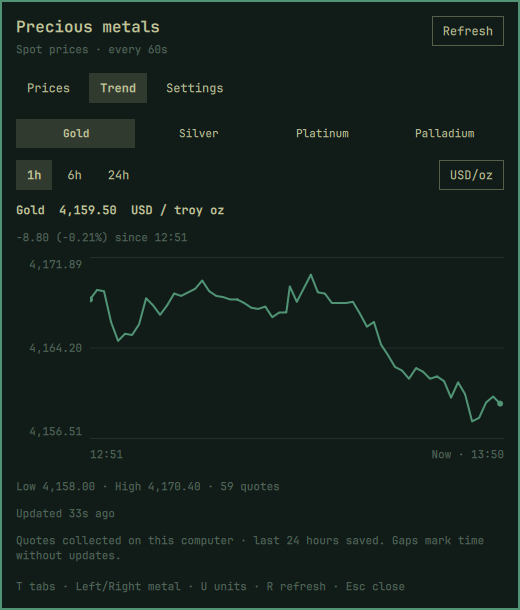
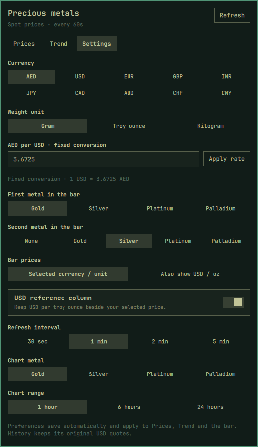
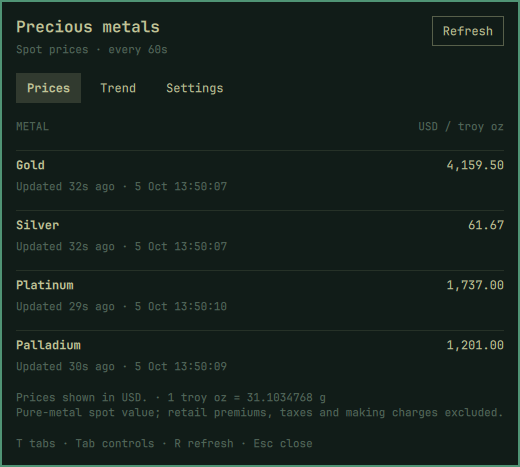

# Precious Metals for Omarchy

A native Quickshell bar plugin for Omarchy Quattro. Gold and silver appear in the bar by default; click for four-metal prices, locally collected trends, and settings for currency, weight unit and bar display.



## Install

Requires Omarchy Quattro with its Quickshell plugin API (tested on Omarchy 4.0.4-1).

```bash
omarchy plugin add https://github.com/hussainanjar/omarchy-precious-metals --enable
```

The native installer lets you review and enable the plugin. For a local checkout or to migrate the earlier `local.precious-metals` prototype:

```bash
git clone https://github.com/hussainanjar/omarchy-precious-metals
cd omarchy-precious-metals
bash install.sh
```

The installer validates the plugin, copies it to `~/.config/omarchy/plugins/io.github.hussainanjar.precious-metals`, saves a backup of the shell configuration and any previous copy, then enables it in the center section beside the calendar. No root access, API key, additional daemon or Python package is required. Omarchy hot-reloads the plugin.

The local installer migrates the prototype ID and preserves its inline settings, bar position, and saved history.

If an existing plugin still shows its old UI after an update, run `omarchy restart shell` to clear Quickshell's component cache.

## Controls

- Left-click: open or close the price popup.
- Right-click: cycle gram, troy ounce and kilogram; the choice is saved.
- Middle-click, popup Refresh, or R in the popup: refresh prices.
- Escape or click outside: close the popup.
- `!` beside a bar price: the quote is stale or its feed is unreachable.

Prices use your selected currency and unit, with an optional USD/troy-ounce reference column. A narrow vertical bar shows the symbols of your chosen metals; the popup provides their prices.

## Trend chart

Choose the **Trend** tab, select Gold, Silver, Platinum or Palladium, then choose 1h / 6h / 24h. Cycle weight units with the units button; hover over the chart to see a quote's time and price. T switches tabs, Tab focuses controls, Left/Right selects a metal, and U changes units. The chosen metal and range are saved.

History builds from genuine provider quotes collected while the widget runs. The chart starts empty and draws after two distinct quote timestamps; earlier market history is not backfilled. Up to 24 hours are saved atomically in `~/.cache/omarchy-precious-metals/history.json` (or under `XDG_CACHE_HOME`). Gaps longer than three refresh intervals or three minutes break the line; repeated stale responses do not create new observations. The change is measured from the first collected quote in the selected window, not from the market's daily close.

## Configure

Open the **Settings** tab in the popup. Preferences save automatically:



- Currency: AED, USD, EUR, GBP, INR, JPY, CAD, AUD, CHF or CNY.
- Weight: gram, troy ounce or kilogram.
- First and optional second bar metal, and whether the bar also shows USD/oz.
- Optional USD reference column, refresh interval and chart metal/range.
- Configurable fixed AED-per-USD rate (press Apply rate or Enter).

Changes apply to Prices, Trend and the bar. You can also use Omarchy widget settings or its CLI:

```bash
omarchy bar set io.github.hussainanjar.precious-metals currency INR
omarchy bar set io.github.hussainanjar.precious-metals unit g
omarchy bar set io.github.hussainanjar.precious-metals barDisplay Both
omarchy bar set io.github.hussainanjar.precious-metals refreshSeconds 60
omarchy bar set io.github.hussainanjar.precious-metals usdToAed 3.6725
omarchy bar move io.github.hussainanjar.precious-metals --section center
```

Settings are stored in the widget's entry in `~/.config/omarchy/shell.json`. The popup rejects invalid settings; externally configured refresh intervals are clamped to 30–3600 seconds. Old `displayMode` preferences remain supported when no explicit currency/unit setting exists.

## Pricing and freshness

Example Prices tab with **USD / troy ounce** selected:



Prices come from the public [Gold API](https://gold-api.com/docs) `/price/XAU`, `/price/XAG`, `/price/XPT` and `/price/XPD` endpoints. The provider calls these real-time spot quotes. This widget polls them every 60 seconds by default; it is not a streaming tick feed. Manual refresh respects the provider's [30-second cache guidance](https://gold-api.com/llms.txt). All monitors share one feed and one history.

AED/g = USD/troy oz × AED-per-USD ÷ 31.1034768. The default exchange rate is the [CBUAE reference rate](https://centralbank.ae/umbraco/Surface/Exchange/GetExchangeRateAllCurrency) of 3.6725 AED per USD; it is a configurable fixed conversion, not a separate live FX feed. These are pure-metal spot values. Jewellery purity, dealer premiums, making charges and taxes are excluded.

Other currencies use the provider's `exchangeRate` from `/price/XAU/{currency}`, refreshed alongside prices. USD needs no conversion. Rates are cached locally; a failed request uses the last known rate and marks it offline. Without a saved rate, converted prices show a dash. Switching currencies cancels an outstanding currency request and applies the matching rate only.

History always stores original USD/troy-ounce quotes. All points in a converted chart use the current or last known conversion rate; historical exchange-rate movements are not included. Gram values divide by 31.1034768; kilogram values multiply gram values by 1000. Switching currency or units preserves your recorded history.

The popup shows the provider's quote timestamp in local time and its age. Quotes older than the greater of three refresh intervals or three minutes are marked stale, including when the source stops updating outside market hours. Requests time out after 15 seconds. A failed request keeps the last successful quote in memory and marks it offline; no successful quote means a dash rather than a fabricated price. The last saved quotes are restored across shell restarts and marked offline until a live response arrives.

## Diagnostics and verification

```bash
omarchy plugin validate .
node tests/model.test.cjs
omarchy-shell io.github.hussainanjar.precious-metals status
omarchy-shell io.github.hussainanjar.precious-metals refresh
omarchy-shell io.github.hussainanjar.precious-metals settings
omarchy-shell shell summon io.github.hussainanjar.precious-metals
```

## Update and remove

For a native Git installation:

```bash
omarchy plugin update io.github.hussainanjar.precious-metals
omarchy plugin disable io.github.hussainanjar.precious-metals
omarchy plugin remove io.github.hussainanjar.precious-metals
```

Removing the plugin preserves locally collected history. To delete that history too, remove `~/.cache/omarchy-precious-metals/history.json` (or its equivalent under `XDG_CACHE_HOME`). A manual installation using `install.sh` can also be disabled and removed with the commands above; update it by pulling this checkout and rerunning `bash install.sh`. The installer reports the backup location if you need to restore the previous shell configuration.

## Dependencies and license

MIT; see [LICENSE](LICENSE). Runtime dependencies are Omarchy Quattro, Qt Quick, Quickshell (including `Quickshell.Io`), and the `mkdir` command from coreutils. Installation uses Omarchy's CLI, Git, Bash, and jq. Node.js is needed only to run the development tests. No API key, background daemon, or additional Python package is needed.

The plugin makes HTTPS requests only to `api.gold-api.com` for prices and currency conversions, reads and writes its history/rate cache in the user cache directory, and runs `mkdir -p` only for that cache directory. Settings update only this widget's entry through Omarchy's plugin API. The optional local installer backs up the existing plugin and shell configuration before copying files and enabling or migrating the widget.
